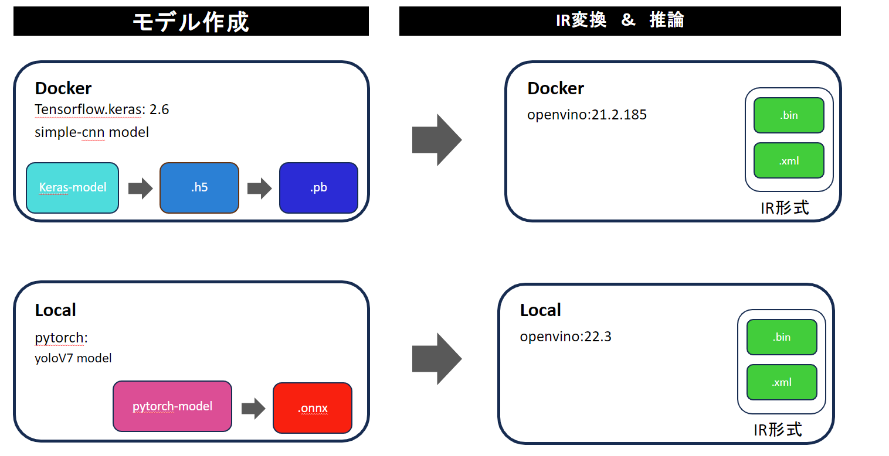

##############################
はじめに
##############################

********************
説明1
********************

hogehoge

********************
説明2
********************
このチュートリアルでは、モデルの作成からVPUでの推論までを扱うが、その方法にはいくつかやり方がある。
例えばネットワークを構築する際の深層学習フレームワークには、``TensorFlow`` や ``PyTorch`` 、``Keras`` 、``Caffe`` などが存在し、
それを実行する環境もローカル上で動かすのか、dockerなどの仮想環境で動かすのかで違ってくる。
さらには、VPUを利用する際に利用するopenvinoと呼ばれるライブラリーにも ``21.x`` ``22.x`` ``23.x``　などのバージョンがあり、その環境の構築方法や
使い方も少しずつことなる。

そこで今回下の図のようにモデル作成と推論に分け、それぞれ2つのチュートリアルを用意した。
モデルの構築ではkerasを使ってDocker環境で単純なCNNモデルを作成するものと、ローカル環境でpytorchを使ってyoloV7モデルを構築する
方法の2種類を用意した。
また、推論ではDocker環境openvino21.2を使って推論を行う方法とローカル環境でopenvino22.3を使って推論する方法の2つがある。

このチュートリアルを参考にしながら、VPUを使ったモデル構築を行ってもらいたい。
もし、自身でモデルの構築から行える方はIR変換&推論から行っていただきたい。
また、PyTorchをDockerで使いたいなどあれば適宜読み替えて、開発環境を整えて欲しい。

********************
注意
********************

本書の掲載内容はできる限り正確に保つように努めていますが、掲載内容の正確性・完全性・信頼性・最新性を保証するものではございません。
本書に起因して読者および第三者に損害が発生したとしても、筆者は責任を負わないものとします。
