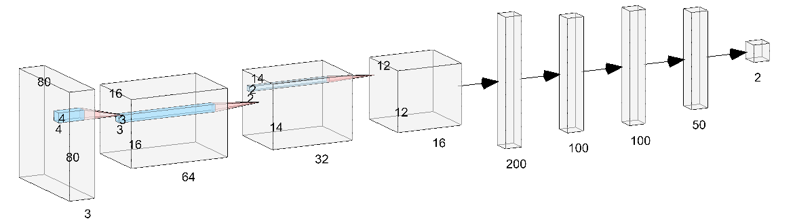

# Docker環境におけるkerasを用いたモデル構築
tensorflow.kerasが使えるdocker環境を作り、データセットを使って船舶識別を行うモデル作成まで行います。

ご自身でモデル構築ができる人は飛ばしてください。
 

## 現状の環境

- ubuntu: 18.04
-  Driver Version: 515.105.01
-  CUDA Version: 11.7  

```
$ nvidia-smi
+-----------------------------------------------------------------------------+
| NVIDIA-SMI 515.105.01   Driver Version: 515.105.01   CUDA Version: 11.7     |
|-------------------------------+----------------------+----------------------+
| GPU  Name        Persistence-M| Bus-Id        Disp.A | Volatile Uncorr. ECC |
| Fan  Temp  Perf  Pwr:Usage/Cap|         Memory-Usage | GPU-Util  Compute M. |
|                               |                      |               MIG M. |
|===============================+======================+======================|
|   0  NVIDIA TITAN V      On   | 00000000:06:00.0 Off |                  N/A |
| 32%   47C    P8    28W / 250W |     25MiB / 12288MiB |      0%      Default |
|                               |                      |                  N/A |
+-------------------------------+----------------------+----------------------+
|   1  NVIDIA TITAN V      On   | 00000000:0A:00.0 Off |                  N/A |
| 28%   39C    P8    25W / 250W |      5MiB / 12288MiB |      0%      Default |
|                               |                      |                  N/A |
+-------------------------------+----------------------+----------------------+

+-----------------------------------------------------------------------------+
| Processes:                                                                  |
|  GPU   GI   CI        PID   Type   Process name                  GPU Memory |
|        ID   ID                                                   Usage      |
|=============================================================================|
|    0   N/A  N/A      2177      G   /usr/lib/xorg/Xorg                  9MiB |
|    0   N/A  N/A      2500      G   /usr/bin/gnome-shell               14MiB |
|    1   N/A  N/A      2177      G   /usr/lib/xorg/Xorg                  4MiB |
+-----------------------------------------------------------------------------+
```


## 出来上がる環境    
- tensorflow 2.6.0
- python3.6.9


## nvidia-container-toolkitの導入
すでに導入されている場合は飛ばして良い。
```
$ curl -s -L https://nvidia.github.io/nvidia-docker/gpgkey | sudo apt-key add -
$ curl -s -L https://nvidia.github.io/nvidia-docker/$(. /etc/os-release;echo $ID$VERSION_ID)/nvidia-docker.list | sudo tee /etc/apt/sources.list.d/nvidia-docker.list
$ sudo apt update
$ sudo apt -y install nvidia-container-toolkit
```
以下のコマンドが実行出来れば完了
```
$ nvidia-container-cli info
NVRM version:   515.105.01
CUDA version:   11.7

Device Index:   0
Device Minor:   1
Model:          NVIDIA TITAN V
Brand:          TITAN
GPU UUID:       GPU-8a3843c1-8daf-fa8c-a6c1-12a24c75a6b9
Bus Location:   00000000:06:00.0
Architecture:   7.0

Device Index:   1
Device Minor:   0
Model:          NVIDIA TITAN V
Brand:          TITAN
GPU UUID:       GPU-8480bc57-d009-1175-2d29-b8ad2b4523f6
Bus Location:   00000000:0a:00.0
Architecture:   7.0

```
一度dockerを再起動しておく
```
$ sudo systemctl restart docker
```
コンテナを立ち上げてエラーが出なければ問題なし
```
$ docker run --rm --gpus all nvidia/cuda:11.0.3-base nvidia-smi
+-----------------------------------------------------------------------------+
| NVIDIA-SMI 515.105.01   Driver Version: 515.105.01   CUDA Version: 11.7     |
|-------------------------------+----------------------+----------------------+
| GPU  Name        Persistence-M| Bus-Id        Disp.A | Volatile Uncorr. ECC |
| Fan  Temp  Perf  Pwr:Usage/Cap|         Memory-Usage | GPU-Util  Compute M. |
|                               |                      |               MIG M. |
|===============================+======================+======================|
|   0  NVIDIA TITAN V      On   | 00000000:06:00.0 Off |                  N/A |
| 32%   47C    P8    28W / 250W |     25MiB / 12288MiB |      0%      Default |
|                               |                      |                  N/A |
+-------------------------------+----------------------+----------------------+
|   1  NVIDIA TITAN V      On   | 00000000:0A:00.0 Off |                  N/A |
| 28%   39C    P8    25W / 250W |      5MiB / 12288MiB |      0%      Default |
|                               |                      |                  N/A |
+-------------------------------+----------------------+----------------------+

+-----------------------------------------------------------------------------+
| Processes:                                                                  |
|  GPU   GI   CI        PID   Type   Process name                  GPU Memory |
|        ID   ID                                                   Usage      |
|=============================================================================|
+-----------------------------------------------------------------------------+
```

エラーが出るようであれば、自身のcudaのバージョンを確認してみる


## docker 環境の構築

    ./
    ├── workspace
    │   ├── 
    │   │   ├── x_test.npy
    │   │   └── y_test.npy
    │   ├── 
    │   └── 
    ├── Docker
    └── docker-compose.yml

- docker-compose.yml
    ```Docker
    version: "3.2"
    services:
    tensorflow_keras:
        build:
        context: .
        dockerfile: Dockerfile
        image: "tensorflwo-keras26"
        container_name: "your_container_name"
        volumes:
        - ./workspace:/workspace
        ports:
        - 8888:8888
        deploy:
        resources:
            reservations:
            devices:
                - driver: nvidia
                count: 1
                capabilities: [gpu]
        environment:
        - NVIDIA_VISIBLE_DEVICES=all
        tty: true
    ```
- Docker
    ```Docker
    FROM tensorflow/tensorflow:2.6.0-gpu-jupyter
    SHELL ["/bin/bash", "-c"]
    ```


## データセットの取得

今回はkaggleで利用されているデータセットを用いて学習を行う。

https://www.kaggle.com/datasets/rhammell/ships-in-satellite-imager

このデータセットは80 $\times$ 80ピクセルの4000枚のRGB画像が含まれており、それらは船か船以外かのラベルを持っている。
詳しくはコンテストページを参照していただきたい。


データセットをダウンロードをダウンロードすると`/shipsnet/shipsnet`に画像データが存在しており、`./shipsnet.json`に数値データが入っているので、使いやすいようにnpyデータとラベルのセットを作成する。


- make_dataset.py

    ```python 
    import pandas  as pd 
    import json 
    import numpy as np 
    from keras.utils import to_categorical
    from sklearn.model_selection import train_test_split


    with open('shipsnet.json') as data_file:
        dataset = json.load(data_file)
    shipsnet= pd.DataFrame(dataset)
    shipsnet.head()

    shipsnet = shipsnet[["data", "labels"]]
    x = np.array(dataset['data']).astype('uint8')
    y = np.array(dataset['labels']).astype('uint8')
    x_reshaped = x.reshape([-1, 3, 80, 80]).transpose([0,2,3,1])
    y_reshaped = to_categorical(y, num_classes=2)
    x_reshaped = x_reshaped / 255
    x_train, x_test, y_train, y_test = train_test_split(x_reshaped, y_reshaped,
                                                            test_size = 0.20, random_state = 42)
    #学習データとテストデータを8：2で分割

    x_train, x_val, y_train, y_val = train_test_split(x_train, y_train, 
                                                    test_size = 0.25, random_state = 42)
    #学習データのうちの25％を検証データとして利用
    np.save("out/x_train",x_train)
    np.save("out/y_train",y_train)
    np.save("out/x_val",x_val)
    np.save("out/y_val",y_val)
    np.save("out/y_test",y_test)
    np.save("out/x_test",x_test)
    ```
    実行すると./outに学習データ、検証データ、テストデータが生成されるのでworkspaceに展開する。
    今後はこれらのデータを使って学習と推論を進める。


## モデルの構築

今回のモデルでは単純な3層CNNを作成する。外観は以下のようになる。


